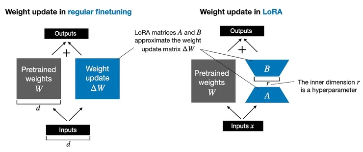

# Low Rank Adaptation - LoRA
---

**Lo**w-**R**ank **A**daptation (*LoRA*) is a machine learning technique that modifies a pretrained model (e.g., an LLM) to better suit a specific, often smaller, dataset by adjusting only a small, low-rank subset of the model's parameters.

This approach is important because it allows for efficient finetuning of large models on task-specific data significantly reducing the computational cost and time required for finetuning.

Since LLMs are large, updating all model weights during training can be expensive due to *GPU* memory limitations. Suppoese we have a large weight matrix *W* for a given layer, during backpropagation, we learn a *ΔW* matrix, which contains information on how much we want to update the original weights to minimize the loss function during training.

In regular training and fine-tuning, the weight update is defined as follows:

$$
W_{updated} = W + ΔW
$$

This [paper](https://arxiv.org/abs/2106.09685), where *LoRA* is proposed offers a more efficient alternative to computing the weight updates *ΔW*
by learning an approximation of it; *ΔW ≈ AB*. In other words, in *LoRA*, we have the following:
$$
W_{updated} = W + A.B
$$
where *A* and *B* are two small weight matrices. The figure below illustrates these formulas for full finetuning and *LoRA* side by side.



### Illustration
---
As mentioned previously, *LoRA* is a technique used to reduce the number of parameters in neural networks by representing large weight matrices as the product of smaller, low-rank matrices. The following illustrates the process.

- **Define the Original Matrix**. Let's say we have an original weight matrix *𝑊* of size *10 × 10*
. We can initialize it with random values for illustration purposes.
$$
\ W \in \mathbb{R}^{10 \times 10} \
$$
- **Decompose into Low-Rank Matrices**. *LoRA* decomposes *W* into two low-rank matrices *A* and *B*, such that ***W ≈ A.B***. Suppose we chose a rank ***r = 2***. Then, *A* will be of size *10 x 2* and *B* of size *2 x 10*.
    $$
    \ A \in \mathbb{R}^{10 \times 2} \
    $$
    $$
    \ B \in \mathbb{R}^{2 \times 10} \
    $$
    The product ***A.B*** will approximate the original matrix ***W***.

- **Initialize and Multiply Matrices**. Let's initialize *W*, *A*, and *B* with random values and then compute the product
$$
 \hat{W} = A \cdot B \ 
$$

- **Compare the Number of Parameters**. The original matrix *W* has *10 X 10 = 100* parameters. The low rank matrices *A* and *B* together have *10 X 2 + 2 X 10 = 40* parameters, which represent a significant reduction.

The following is a simple python code demonestating the process.

```python
import numpy as np

# Original matrix W
W = np.random.rand(10, 10)

# Low-rank approximation matrices A and B
rank = 2
A = np.random.rand(10, rank)
B = np.random.rand(rank, 10)

# Approximate W with A * B
W_approx = np.dot(A, B)

# Print the matrices
print("Original Matrix W:")
print(W)
print("\nMatrix A:")
print(A)
print("\nMatrix B:")
print(B)
print("\nApproximated Matrix W_approx (A * B):")
print(W_approx)

# Number of parameters
params_W = W.size
params_A_B = A.size + B.size

print(f"\nNumber of parameters in W: {params_W}")
print(f"Number of parameters in A and B: {params_A_B}")
```
Output:
```bash
Original Matrix W:
[[0.27623515 0.63215998 0.92459435 0.12553922 0.1324817  0.62949987
  0.67642814 0.20044365 0.15545272 0.31994525]
 [0.31620771 0.73463356 0.40055041 0.87588128 0.78227843 0.90167607
  0.32959735 0.28369558 0.42492724 0.133431  ]
 [0.87525289 0.32988044 0.83585347 0.93829371 0.09390059 0.25781041
  0.51288144 0.91023738 0.93678052 0.40134471]
 [0.10761006 0.26557536 0.89544327 0.32928028 0.46488922 0.97024327
  0.52649051 0.00352671 0.82629554 0.43071364]
 [0.52791184 0.59928369 0.46913586 0.68322513 0.67940471 0.08802975
  0.80061053 0.97934069 0.46685688 0.69116909]
 [0.647555   0.25602217 0.25908842 0.8408801  0.90313406 0.43487419
  0.48209494 0.22609687 0.05766792 0.06151783]
 [0.99683345 0.76136488 0.65484794 0.43741365 0.75294596 0.20422666
  0.32325106 0.07004434 0.73373486 0.81046958]
 [0.15282686 0.09544934 0.19786853 0.60568179 0.36603849 0.42335153
  0.17983766 0.71277869 0.92063546 0.78758077]
 [0.34864647 0.54255032 0.58589173 0.94692057 0.28321406 0.92025639
  0.19620399 0.82872165 0.07697296 0.98053256]
 [0.7383354  0.96089536 0.89232405 0.91668038 0.55144295 0.00813285
  0.62078543 0.29474621 0.21108933 0.5899842 ]]

Matrix A:
[[0.3110704  0.10658434]
 [0.62173576 0.73818873]
 [0.54926617 0.56041878]
 [0.22147023 0.60311169]
 [0.17182113 0.37406109]
 [0.99814917 0.32537948]
 [0.87918457 0.77123608]
 [0.29484671 0.58833995]
 [0.20611887 0.92893633]
 [0.99490618 0.01330527]]

Matrix B:
[[0.18328231 0.63895546 0.4695206  0.45351238 0.36120203 0.58381646
  0.6565954  0.85317408 0.09397047 0.17115193]
 [0.56269451 0.25342736 0.70779341 0.36000381 0.6444166  0.48665417
  0.18000402 0.03411301 0.69491744 0.7970297 ]]

Approximated Matrix W_approx (A * B):
[[0.11698812 0.22577152 0.22149365 0.17944504 0.18104398 0.23347773
  0.223433   0.26903311 0.10329875 0.13819118]
 [0.52932791 0.58433867 0.81440286 0.54771561 0.70027329 0.72222219
  0.54110578 0.55563067 0.57140502 0.69476962]
 [0.41601534 0.49298207 0.6545525  0.4508519  0.55953922 0.59340076
  0.46152328 0.48773723 0.44105958 0.54067837]
 [0.37995921 0.29435462 0.53086332 0.317562   0.46865068 0.42280479
  0.25397887 0.20952662 0.43992449 0.51860299]
 [0.2419739  0.20458336 0.34543154 0.21258643 0.30311332 0.2823504
  0.18014947 0.15935369 0.27608769 0.32754532]
 [0.36603233 0.72023292 0.69895305 0.56981085 0.57021344 0.74108319
  0.71394976 0.86269467 0.31990842 0.43017226]
 [0.59510928 0.7572121  0.95867108 0.67636901 0.81456058 0.88860767
  0.71609414 0.77640667 0.61856279 0.76517219]
 [0.38509584 0.33749535 0.55485974 0.34552125 0.48563526 0.45845445
  0.29949855 0.27162562 0.43655458 0.519388  ]
 [0.56048531 0.36711866 0.75427207 0.42789807 0.67307255 0.57240633
  0.30254898 0.2075441  0.66490314 0.77566749]
 [0.18983551 0.63907265 0.47654633 0.45599222 0.36793627 0.58731767
  0.65564582 0.84928204 0.10273787 0.18088481]]

Number of parameters in W: 100
Number of parameters in A and B: 40
```

### How does LoRA save GPU memory

Consider larger dimensions than above, say we have a pretrained weight matrix *W* which is a *1000 X 1000* matrix. Then the weight update matrix *ΔW* in regular fine-tuning is a *1000 X 1000* matrix as well. In this case, *ΔW* has *1,000,000* parameters. In case *LoRA* is cosidered, and a rank of *2* is used, then *A* is a *100 X 2* matrix, and *B* is a *2 X 1000* matrix. Hence, the result will be *2 X 2 X 1000 = 4000* parameters, which to be updated when *LoRA* is used. This implies, that we've got *25 times* fewer parameters.

Of course, *A* and *B* can't capture all the information that *ΔW* could, but this is by design. When using *LoRA*, we hypothesize that the model requires *W* to be a large matrix with full rank to capture all the knowledge in the pretraining dataset. However, when we finetune an LLM, we don't need to update all the weights and capture the core information for the adaptation in a smaller number of weights than *ΔW* would; hence, we have the low-rank updates via *A.B*.

If we paid close attention, the full finetuning and *LoRA* depictions in the figure above look slightly different from the formulas I have shown earlier. This is due to the distributive law of matrix multiplication; we don't have to add the weights with the updated weights but can keep them separate. For instance, if *x* is the input data, then we can write the following for regular finetuning:

$$
x.(W + ΔW) = x.W + x.ΔW
$$

Similarly, we can write the following for *LoRA*:
$$
x.(W + A.B) = x.W + x.A.B
$$

The fact that we can keep the *LoRA* weight matrices separate makes *LoRA* especially attractive. In practice, this means that we don't have to modify the weights of the pretrained model at all, as we can apply the *LoRA* matrices on the fly. This is especially useful if you are considering hosting a model for multiple customers. Instead of having to save the large updated models for each customer, you only have to save the small set of *LoRA* weights alongside the original pretrained model.

### A Step-by-Step Implementation
We begin by initializing the ```LoRALayer``` that creates the matrices *A* and *B*, along with the *alpha* scaling hyperparameter and the *rank* hyperparameters. This layer can accept an input and compute the corresponding output, as illustrated in the figure **ABOVE** (The *LoRA* matrices *A* and *B* with rank *r*).

```python
class LoRALayer(nn.Module):
    def __init__(self, in_dim, out_dim, rank, alpha):
        super().__init__()
...
```

In this code above, *rank* is the hyperparameter that controls the inner dimension of the matrices *A* and *B*. In other words, this parameter controls the number of additional parameters introduced by *LoRA* and is a key factor in determining the balance between model adaptability and parameter efficiency.

The second hyperparameter, *alpha* is a scaling hyperparameter applied to the output of the low-rank adaptation. It essentially controls the extent to which the adapted layer's output is allowed to influence the original output of the layer being adapted. This can be seen as a way to regulate the impact of the low-rank adaptation on the layer's output.

So far, the ```LoRALayer``` class we implemented above allows us to transform the layer inputs *x*. However, in *LoRA*, we are usually interested in replacing existing ```Linear``` layers so that the weight update is applied to the existing pretrained weights, as shown in the ***FIGURE*** below (LoRA applied to an existing linear layer):

***IMAGE***

To incorporate the original Linear layer weights as shown in the figure ***ABOVE***, we will implement a ```LinearWithLoRA``` layer that uses the previously implemented ```LoRALayer``` and can be used to replace existing ```Linear``` layers in a neural network, for example; self-attention module or feed forward modules in an *LLM*:

```python
class LinearWithLoRA(nn.Module):
    def __init__(self, linear, rank, alpha):
        super().__init__()
...
```

Note that since we initialize the weight matrix *B* (```self.b``` in ```LoRALayer```) with zero values in the *LoRA* layer, the matrix multiplication between *A* and *B* results in a matrix consisting of *0's* and doesn't affect the original weights (since adding *0* to the original weights does not modify them).

#### Applying LoRA to Linear Layer
Let's apply *LoRA* to the Linear layer, we see that the results are the same since we haven't trained the *LoRA* weights yet. In other words, everything works as expected:

```python
layer_lora_1=LinearWithLoRA(layer, rank=2, alpha=4)
print(layer_lora_1(x))
"""
tensor([[0.6639, 0.4487]], grad_fn=<AddBackward0>)
"""
```

#### Merging *LoRA* matrices and Original Weights
As we mentioned above, the distributive law of matrix multiplication
$$
x(W + A.B) = x.W + x.A.B
$$
This means that we can also combine or merge the *LoRA* matrices and original weights, which should result in an equivalent implementation. In code, this alternative implementation to the ```LinearWithLoRA``` layer looks as follows:

```python
class LinearWithLoRAMerged(nn.Module):
    def __init__(self, linear, rank, alpha):
        super().__init__()
...
```

```LinearWithLoRAMerged``` calculates the left side of the equation above, whereas ```LinearWithLoRA``` calculates the right side.

#### Applying *LoRA* Layers to *LLM*
Using ***PyTorch*** enables us to easily replace a linear layer in an existing neural network (e.g., the feed forward or attention modules of a *LLM*) with our new ```LinearWithLoRA``` and ```LinearWithLoRAMerged```.

#### Multilayer Perceptron Model (without *LoRA*)
For simplicity, let's focus on a small *3-layer* multilayer perception instead of an *LLM* for now, which is illustrated in the figure below:
<!--  -->
```python
class MultilayerPerceptron(nn.Module):
    def __init__(self, num_features, num_hidden_1, num_hidden_2, num_classes):
        super().__init__()
...
```

#### Defining Hyperparameters
```python
num_features=784
num_hidden_1=128
num_hidden_2=256
num_classes=10

DEVICE=torch.device('cuda' if torch.cuda.is_available() else 'cpu')

learning_rate=0.005
num_epochs=10
```

#### Loading dataset
```python
from torchvision import datasets
from torchvision import transforms
from torch.utils.data import DataLoader

BATCH_SIZE=64

# Note: transforms.ToTensor() scales input images to 0-1 range
train_dataset=datasets.MNIST(root='data', train=True, transform=transforms.ToTensor(), download=True)

test_dataset=datasets.MNIST(root='data', train=False, transform=transforms.ToTensor())

train_loader=DataLoader(dataset=train_dataset, batch_size=BATCH_SIZE, shuffle=True)

test_loader=DataLoader(dataset=test_dataset, batch_size=BATCH_SIZE, shuffle=False)

for images, labels in train_loader:
    print('Image batch dimensions:', images.shape)
    print('Image label dimensions:', labels.shape)
    break
```

#### Implementing Evaluation Metric(s)
```python
def compute_accuracy(model, data_loader, device):
    model.eval()
    correct_pred, num_examples=0,0
    with torch.no_grad():
        for features, targets in data_loader:
            features=features.view(-1, 28*28).to(device)
            targets=targets.to(device)
            logits=model(features)
            _, predicted_labels=torch.max(logits,1)
            num_examples+=targets.size(0)
            correct_pred+=(predicted_labels==targets).sum()
        return correct_pred.float()/num_examples*100
```

#### Model Training
```python
import time

def train(num_epochs, model, optimizer, train_loader, device):
    start_time=time.time()
    for epoch in range(num_epochs):
        model.train()
        for batch_idx, (features, targets) in enumerate(train_loader):
            features=features.view(-1, 28*28).to(device)
            targets=targets.to(device)
            
            # forward and back propagation
            logits=model(features)
            loss=F.cross_entropy(logits, targets)
            optimizer.zero_grad()
            
            loss.backward()
            
            # update model parameters
            optimizer.step()
...
```

#### Replacing *Linear* with *LoRA* Layer

Using ```LinearWithLoRA```, we can then add the *LoRA* layers by replacing the original ```Linear``` layers in the multilayer perception model:
```python
import copy

model_lora=copy.deepcopy(model)

model_lora.layers[0]=LinearWithLoRAMerged(model_lora.layers[0], rank=4, alpha=8)
model_lora.layers[2]=LinearWithLoRAMerged(model_lora.layers[2], rank=4, alpha=8)
model_lora.layers[4]=LinearWithLoRAMerged(model_lora.layers[4], rank=4, alpha=8)
model_lora.to(DEVICE)
optimizer_lora=torch.optim.Adam(model_lora.parameters(), lr=learning_rate)
print(model_lora)

"""
MultilayerPerceptron(
  (layers): Sequential(
    (0): LinearWithLoRAMerged(
      (linear): Linear(in_features=784, out_features=128, bias=True)
      (lora): LoRALayer()
    )
    (1): ReLU()
    (2): LinearWithLoRAMerged(
      (linear): Linear(in_features=128, out_features=256, bias=True)
      (lora): LoRALayer()
    )
    (3): ReLU()
    (4): LinearWithLoRAMerged(
      (linear): Linear(in_features=256, out_features=10, bias=True)
      (lora): LoRALayer()
    )
  )
)
"""
```

#### Freezing the Original *Linear* Layers
Then, we can freeze the original ```Linear``` layers and only make the ```LoRALinear``` layers trainable, as follows:
```python
def freeze_linear_layers(model):
    for child in model.children():
        if isinstance(child, nn.Linear):
            for param in child.parameters():
                param.requires_grad=False
        else:
            # recursively freeze linear layers in children modules
            freeze_linear_layers(child)

freeze_linear_layers(model_lora)
for name, param in model_lora.named_parameters():
    print(f'{name}:{param.requires_grad}')

"""
layers.0.linear.weight:False
layers.0.linear.bias:False
layers.0.lora.A:True
layers.0.lora.B:True
layers.2.linear.weight:False
layers.2.linear.bias:False
layers.2.lora.A:True
layers.2.lora.B:True
layers.4.linear.weight:False
layers.4.linear.bias:False
layers.4.lora.A:True
layers.4.lora.B:True
"""
```

###
---

